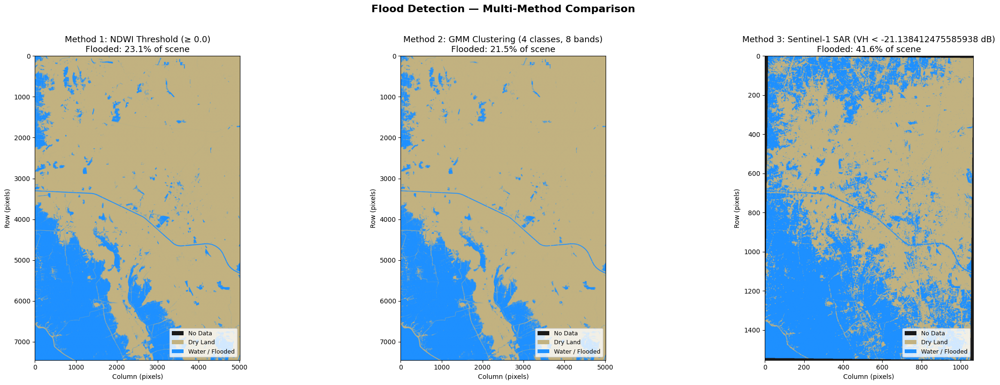

# Pakistan 2022 Monsoon Flood Detection — Methodology and Results

**Author:** Brian Perlman | **Date:** September 2022 analysis, documented 22 February 2026

---

## 1. Background

The [2022 Pakistan monsoon floods](https://www.britannica.com/event/Pakistan-floods-of-2022) submerged approximately one-third of the country, displacing millions of people and causing widespread destruction across Sindh and Punjab provinces along the Indus River floodplain. This notebook demonstrates a multi-method flood detection workflow using Maxar Open Data VHR optical satellite imagery (with both NDVI and unsupervised ML analysis methods) and compared with analysis of Sentinel-1 SAR data sourced from Google Earth Engine.

**Study area:** Sindh province, approximately 12 km × 15 km centered on (26.55°N, 67.69°E), northwest of Mohenjo-daro along the Indus River corridor, just north of Manchar Lake, where massive flooding occurred. The study area had a mix of flooding and vegetation which provided an opportunity to demonstrate how to disambiguate flooded areas from areas that might appear as flooded in optical imagery but are in fact unaffected by flooding.

---

## 2. Data Sources

| Source | Sensor | Resolution | Bands | Date | Purpose |
|--------|--------|-----------|-------|------|---------|
| Maxar Open Data (post-flood) | WorldView-2 | 2 m | 8-band multispectral | 2022-09-03 | Flood detection |
| Maxar Open Data (pre-flood) | WorldView-3 | 2 m | 8-band multispectral | 2022-04-28 | Before/after comparison |
| Sentinel-1 GRD (via GEE) | S1A C-band SAR | 10 m | VH polarization | 2022-08-30 | Independent SAR validation |
| Flood Extent | — | — | Vector (GeoJSON) | 2022-08-29 | AOI selection and validation |

Maxar data was accessed as Cloud Optimized GeoTIFFs (COGs) streamed from S3 via the Maxar Open Data STAC catalog. The 8-band WorldView-2 multispectral ordering is: Coastal (0), Blue (1), Green (2), Yellow (3), Red (4), Red Edge (5), NIR1 (6), NIR2 (7).

---

## 3. Tile Selection Methodology

The Maxar Open Data catalog for the Pakistan flooding event contains 2,549 items, of which 1,766 have multispectral (`ms_analytic`) assets required for NDWI computation.

The selection pipeline addresses several challenges:

- **Targeting confirmed new flooding:** All 1,766 ms_analytic tiles were scored against an MSF flood extent GeoJSON (7,397 polygons, EPSG:3857 → WGS84). Permanent water bodies (e.g., Manchar Lake) were excluded so only monsoon-induced inundation was targeted.
- **Eliminating edge-of-swath strips:** Maxar ARD tiles sit on a fixed 5 km grid. Satellite swath edges produce narrow slivers with >70% nodata. Tiles with bounding box dimensions below 70% of the maximum were rejected.
- **Ensuring spatial contiguity:** A greedy adjacency clustering algorithm selected the tightest cluster of 6 tiles to avoid black gaps in the mosaic.
- **Resolving band count mismatches:** WV02/WV03 tiles (8-band) were kept separate from GE01 tiles (4-band) to prevent `rasterio.merge()` failures.

The final mosaic comprises 6 adjacent WV02 tiles from two satellite passes (catalog IDs `10300100D9410100` and `10300100D9316B00`) captured on 2022-09-03, producing an 8-band mosaic of 7,445 × 5,014 pixels (EPSG:32642).

---

## 4. Before/After Comparison

Pre-flood imagery for the same 6 grid cells was identified from 2022-04-28 (WV03, 8-band). The comparison confirms the detected inundation is new — the landscape was dry agricultural land prior to the monsoon.


*Left:* Pre-flood true color (2022-04-28) showing dry agricultural fields and settlements. *Center:* Post-flood true color (2022-09-03) showing widespread dark water bodies and saturated terrain. *Right:* Post-flood false color composite (NIR1/Red/Green) where healthy vegetation appears bright red and standing water appears dark blue-black, making flood boundaries clearly visible.

---

## 5. Flood Detection Methods

Three independent methods were applied to classify flooded vs. dry areas.

### 5.1 Method 1 — NDWI Threshold

The Normalized Difference Water Index exploits the physical property that water reflects green light and absorbs near-infrared:

```
NDWI = (Green [band 2] - NIR1 [band 6]) / (Green [band 2] + NIR1 [band 6])
```

A threshold of NDWI ≥ 0.0 classifies pixels as water. The histogram below shows a clear bimodal distribution with the land peak around NDWI = −0.2 and the water peak around NDWI = +0.7, confirming the threshold is well-positioned in the valley between the two modes.


*Left:* NDWI continuous values (blue = water, red = dry land). *Right:* Histogram of NDWI values with the 0.0 threshold shown in red, positioned in the valley between the land and water peaks.

The resulting classification map:


*Left:* Post-flood true color satellite mosaic. *Right:* NDWI flood classification — 23.1% of the scene classified as flooded (blue), concentrated along drainage channels, low-lying agricultural fields, and the river corridor in the southwest.

### 5.2 Method 2 — Gaussian Mixture Model (GMM) Clustering

Where NDWI uses only 2 of the 8 available spectral bands, Gaussian Mixture Model clustering leverages the full 8-band spectral signature to discover natural land cover classes.

A 4-component GMM (representing water, vegetation, bare soil, and built-up/other) was fitted on a random subsample of 200,000 pixels (normalized to 0–1 per band). The model was then applied to all 37.3 million valid pixels. The water cluster was identified automatically as the component with the highest mean NDWI (+0.533).

The GMM classified **21.5%** of the scene as flooded — closely agreeing with the NDWI result (23.1%). The slight difference arises because the GMM assigns ambiguous pixels near the water-land boundary more conservatively by considering all 8 bands simultaneously.

### 5.3 Method 3 — Sentinel-1 SAR Backscatter

C-band synthetic aperture radar provides a sensor-independent validation: radar penetrates cloud cover and measures surface roughness rather than spectral reflectance. Smooth open water reflects radar energy away from the sensor (specular reflection), producing characteristically low backscatter values.

A single Sentinel-1A IW GRD scene (descending orbit, 2022-08-30) was accessed via Google Earth Engine and clipped to the AOI at 10 m resolution. Two important methodological decisions were required:

- **Single orbit direction:** Mixing ascending and descending scenes (which have different incidence angles) smears the backscatter distribution and depresses all values, causing catastrophic over-classification. Only descending-orbit scenes were used.
- **Adaptive thresholding:** A fixed −16 dB cutoff (standard for normal conditions) classified 83.5% of the scene as flooded — clearly erroneous. During active monsoon flooding, even non-inundated land has depressed backscatter due to soil saturation. A 2-component GMM fitted to the VH histogram identified distinct water (−26.5 dB) and land (−15.7 dB) peaks, yielding an adaptive threshold of **−21.1 dB**.

The SAR method classified **41.6%** of the scene as flooded — higher than the optical methods. This is expected: SAR detects shallow standing water and waterlogged soil that appears spectrally dry in optical imagery, and the 10 m resolution causes mixed pixels at water-land boundaries to be classified as water.

---

## 6. Multi-Method Comparison



*Left:* NDWI threshold (23.1% flooded). *Center:* GMM 8-band clustering (21.5% flooded). *Right:* Sentinel-1 SAR backscatter (41.6% flooded). All three methods identify the same major flood features — inundated agricultural fields in the north, the river corridor in the southwest, and drainage channel flooding — but differ in sensitivity at the margins.

Note that the MSF finalized flood extent map comports well with my findings, especially when taking into consideration the more sensitive S1 approach.


Source: https://geo.geomsf.org/portal/apps/webappviewer/index.html?id=b22ae122fae442ec942c3c26285efcb0

### Quantitative Results

| Method | Input | Flooded (%) | Flood Pixels |
|--------|-------|------------|--------------|
| NDWI threshold (≥ 0.0) | 2 bands (Green, NIR1) | 23.1% | 8,630,237 |
| GMM clustering (4 classes) | 8 bands (full spectrum) | 21.5% | 8,015,435 |
| Sentinel-1 SAR (VH < −21.1 dB) | C-band radar (VH) | 41.6% | 673,027* |

*\*SAR pixel count is lower because Sentinel-1 operates at 10 m resolution vs. 2 m for WV02; the percentage flooded is the meaningful comparison metric.*

### NDWI vs. GMM Pixel-Level Agreement

| | GMM: Water | GMM: Dry |
|---|-----------|----------|
| **NDWI: Water** | 7,986,140 (21.4%) | 644,097 (1.7%) |
| **NDWI: Dry** | 29,295 (0.1%) | 28,669,698 (76.8%) |

**Overall agreement: 98.2%.** The two optical methods are highly consistent. The 1.7% of pixels classified as water by NDWI but not by GMM likely represent mixed pixels at water-land boundaries where the full spectral signature is ambiguous.

### Interpreting the SAR Discrepancy

The SAR method detects substantially more flooding (41.6% vs. ~22%) for several physically grounded reasons:

- **Sensitivity to shallow water:** SAR responds to surface roughness changes caused by even centimeters of standing water that remain spectrally invisible in optical imagery.
- **Soil moisture sensitivity:** Saturated but non-inundated soil depresses VH backscatter, causing some false positives.
- **Temporal offset:** The SAR scene (2022-08-30) predates the optical imagery (2022-09-03) by 4 days — flood extent may have been larger at the earlier date.
- **Resolution effects:** At 10 m, mixed pixels containing partial water coverage are more likely to fall below the backscatter threshold.

---

## 7. Output Files

| File | Description | Size |
|------|-------------|------|
| `*_mosaic.tif` | 8-band WV02 mosaic, EPSG:32642 | ~100 MB |
| `*_flood_classification.tif` | NDWI flood map (0=nodata, 1=dry, 2=water) | 0.9 MB |
| `*_flood_gmm.tif` | GMM flood map (0=nodata, 1=dry, 2=water) | 0.9 MB |
| `*_flood_sar.tif` | SAR flood map (0=nodata, 1=dry, 2=water) | 0.1 MB |

All classification maps use the same schema: pixel value 0 = no data, 1 = dry land, 2 = water/flooded. Optical products are in EPSG:32642 (UTM Zone 42N) at 2 m resolution; the SAR product is in EPSG:4326 at 10 m resolution.

---

## 8. Dependencies

```
pystac-client          # STAC catalog access
rasterio               # Raster I/O and mosaicking
numpy, matplotlib      # Computation and visualization
scikit-learn           # GMM clustering
earthengine-api        # Sentinel-1 via Google Earth Engine
boto3                  # S3 upload
```

---

## 9. Reproducibility

To re-run the notebook:

1. Place `floodextentpak.geojson` in the same directory as the notebook
2. Provide AWS credentials in `ext_recruitment_user_4_creds.txt`
3. Authenticate to Earth Engine: `earthengine authenticate`
4. Run all cells sequentially (Cells 0–35)

The tile selection is deterministic given the same STAC catalog state. GEE results may vary slightly if Sentinel-1 reprocessing campaigns update the GRD archive.

---

**Transparency note:** Claude Opus 4.6 (Anthropic) assisted in developing this notebook. I am responsible for all content.
